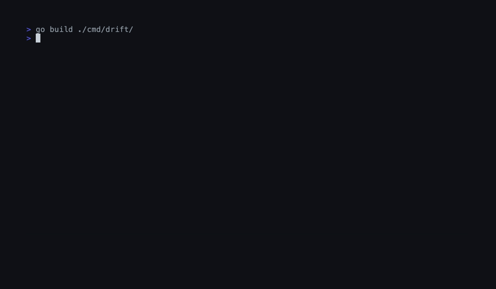

# drift

[](https://github.com/greatnessinabox/drift/actions/workflows/ci.yml)
[](https://github.com/greatnessinabox/drift)
[](LICENSE)
[](https://github.com/greatnessinabox/drift/releases)

**Real-time multi-language codebase health dashboard with GitHub Copilot CLI integration.**

drift watches your codebase in real-time, detects code health degradation, and uses AI to diagnose problems and suggest fixes. Think Datadog for your codebase, in your terminal.

> 🏆 **Built for the [GitHub Copilot CLI Challenge](https://dev.to/challenges/github-2026-01-21)**  
> drift showcases deep GitHub Copilot CLI integration with interactive fixing, custom agents, and AI-powered PR comments.

Supports **Go**, **TypeScript/JavaScript**, **Python**, **Rust**, **Java**, **Ruby**, **PHP**, and **C#** with automatic language detection.



```
◆ DRIFT — codebase health monitor        typescript · 84 files · 312 functions
┌──────────────────────────────────────────────────────────────┐
│  ████████████████████░░░░░░░░  72/100  ▲ +3  ▁▃▅▆▇█▇▆▅▇    │
╰──────────────────────────────────────────────────────────────╯
┌─ COMPLEXITY ─────────────────┐┌─ DEPENDENCIES ───────────────┐
│  ✗ parser.ts:47        32   ││  ✓ express       4.21 current │
│  ⚠ transform.tsx:12    28   ││  ⚠ lodash        4.17  34d   │
│    main.ts:8           12   ││  ✗ axios         1.6   180d  │
╰──────────────────────────────╯╰──────────────────────────────╯
┌─ BOUNDARIES ─────────────────┐┌─ ACTIVITY ───────────────────┐
│  ✗ api → db (3 hits)        ││  14:32  parser.ts modified    │
│  ✓ cmd → pkg                ││  14:31  package.json updated  │
╰──────────────────────────────╯╰──────────────────────────────╯
 [tab] navigate  [d] diagnose  [r] refresh  [q] quit
```

## Features

- **🤖 AI Agent Support** — Works with GitHub Copilot, Claude Code, Cursor, Aider, and more (see [AI_AGENTS.md](.github/AI_AGENTS.md))
- **🌐 Multi-Language** — Auto-detects Go, TypeScript/JS, Python, Rust, Java, Ruby, PHP, and C# from project manifest files
- **🎨 Live Dashboard** — Full-screen TUI that updates in real-time as you edit code
- **📈 Sparkline Trends** — Visualize health metrics over the last 10 commits with inline charts
- **🔧 Cyclomatic Complexity** — Go uses full AST analysis; other languages use heuristic pattern matching
- **📦 Dependency Freshness** — Checks dependencies against their registry (Go proxy, npm, PyPI, crates.io, Maven Central, RubyGems, Packagist, NuGet)
- **🏗️ Architecture Boundaries** — Define import rules and catch violations instantly
- **☠️ Dead Code Detection** — Finds exported functions with zero callers
- **💬 AI Diagnostics** — Press `d` to get AI-powered analysis via Claude or GPT-4o
- **📊 Health Score** — Weighted 0-100 score with animated transitions
- **✅ CI-Friendly** — `drift check` + GitHub Action for automated PR comments

## Supported Languages

| Language | Manifest | Analysis | Dependency Registry |
|----------|----------|----------|---------------------|
| Go | `go.mod` | Full AST (`go/ast`) | Go module proxy |
| TypeScript/JS | `package.json` | Heuristic regex | npm registry |
| Python | `pyproject.toml` / `requirements.txt` | Heuristic + indentation | PyPI |
| Rust | `Cargo.toml` | Heuristic regex | crates.io |
| Java | `pom.xml` / `build.gradle` | Heuristic regex | Maven Central |
| Ruby | `Gemfile` | Heuristic + def/end tracking | RubyGems |
| PHP | `composer.json` | Heuristic regex | Packagist |
| C# | `*.csproj` | Heuristic regex | NuGet |

drift auto-detects the language by checking for manifest files. You can also set it explicitly in `.drift.yaml`:

```yaml
language: typescript  # or "go", "python", "rust", "java", "ruby", "php", "csharp"
```

## Install

```bash
go install github.com/greatnessinabox/drift/cmd/drift@latest
```

Or build from source:

```bash
git clone https://github.com/greatnessinabox/drift.git
cd drift
go build ./cmd/drift/
```

**macOS note:** If macOS blocks drift with a Gatekeeper warning, open **System Settings > Privacy & Security** and click **Allow Anyway**, or run `xattr -d com.apple.quarantine $(which drift)`.

## Quick Start

```bash
# Run the live dashboard in any supported project
cd your-project
drift

# Generate a report
drift report

# Check health (for CI)
drift check --fail-under 70

# 🆕 Interactive fix with GitHub Copilot CLI
drift fix

# Use custom agent commands
copilot --agent drift-dev "analyze src/"
```

## 🤖 GitHub Copilot CLI Integration

drift showcases three powerful GitHub Copilot CLI integration patterns for the [GitHub Copilot CLI Challenge](https://dev.to/challenges/github-2026-01-21).

> **💡 Beyond Copilot:** drift works with **any AI coding assistant** (Claude Code, Cursor, Aider, etc.). See [.github/AI_AGENTS.md](.github/AI_AGENTS.md) for complete multi-agent guide.

### Interactive Fixing

Use `drift fix` to get AI-powered refactoring suggestions:

```bash
$ drift fix

🔍 Analyzing codebase... (Score: 78/100)

Found 3 issue(s) to fix:

1. [🔴 HIGH] model.Update() in app.go:126 (complexity: 25)

🤖 Asking GitHub Copilot for suggestions...
[Copilot provides detailed refactoring with code examples]

Apply this suggestion? [y/N/s(kip rest)] y
```

**Requirements:**
```bash
brew install copilot-cli
# or: npm install -g @github/copilot
# or: curl -fsSL https://gh.io/copilot-install | bash
```

### Custom Agent

Use `@drift` commands in Copilot CLI:

```bash
copilot --agent drift-dev "analyze internal/analyzer/"
copilot --agent drift-dev "suggest-refactor complexFunction()"
copilot --agent drift-dev "explain complexity"
```

See [`.github/agents/drift-dev.agent.md`](.github/agents/drift-dev.agent.md) for all commands.

### GitHub Action

Add drift to your CI pipeline with AI-powered PR comments:

```yaml
# .github/workflows/drift.yml
name: Code Health
on: [pull_request]

jobs:
  drift:
    runs-on: ubuntu-latest
    steps:
      - uses: actions/checkout@v4
      - uses: actions/setup-go@v5
        with:
          go-version-file: go.mod
      - run: go install github.com/greatnessinabox/drift/cmd/drift@latest
      - run: drift check --fail-under 70
```

See [`.github/workflows/drift-health.yml`](.github/workflows/drift-health.yml) for a complete example with Copilot-generated PR summaries.

## Configuration

Create a `.drift.yaml` in your project root:

```yaml
# Language (empty = auto-detect from manifest files)
language: ""

# Directories to exclude
exclude:
  - vendor
  - node_modules
  - .git
  - __pycache__
  - target

# Metric weights (must sum to 1.0)
weights:
  complexity: 0.30
  deps: 0.20
  boundaries: 0.20
  dead_code: 0.15
  coverage: 0.15

# Architecture boundary rules
boundaries:
  - deny: "pkg/api -> internal/db"
  - deny: "cmd -> internal/tui"

# AI diagnostics (optional)
ai:
  provider: anthropic  # or "openai"
  model: ""            # uses sensible defaults

# Thresholds
thresholds:
  max_complexity: 15
  max_stale_days: 90
  min_score: 70
```

## AI Diagnostics

Press `d` in the dashboard to trigger an AI diagnosis. Works with:

- **Anthropic Claude** (Sonnet 3.5, 3.7, Opus, Haiku) — Set `ANTHROPIC_API_KEY` env var
- **OpenAI GPT-4o / o1** — Set `OPENAI_API_KEY` env var

Configure in `.drift.yaml`:
```yaml
ai:
  provider: anthropic  # or "openai"
  model: ""            # uses sensible defaults
```

The AI analyzes your worst-scoring metrics and provides specific, actionable recommendations with code snippets.

**Beyond built-in diagnostics:** drift works with any AI coding assistant. See [.github/AI_AGENTS.md](.github/AI_AGENTS.md) for workflows with Claude Code, Cursor, Aider, and more.

## Keyboard Shortcuts

| Key | Action |
|-----|--------|
| `tab` | Navigate between panels |
| `shift+tab` | Navigate backwards |
| `d` | Run AI diagnosis |
| `r` | Force full re-analysis |
| `q` / `ctrl+c` | Quit |
| `esc` | Close diagnosis overlay |

## How It Works

1. **Language Detection** — Checks for manifest files (`go.mod`, `package.json`, `Cargo.toml`, etc.) to determine the project language
2. **Analysis Engine** — Go projects get full AST analysis; other languages use heuristic regex-based pattern matching for complexity, imports, and dead code
3. **Dependency Checker** — Reads the language-specific manifest and queries the appropriate registry for latest versions
4. **File Watcher** — Uses `fsnotify` with 200ms debounce, watching only files matching the detected language's extensions
5. **History Analyzer** — Uses `go-git` to walk commit history and generate sparkline trends
6. **Health Score** — Weighted average of all metrics, with configurable thresholds
7. **TUI** — Built with [Bubble Tea](https://github.com/charmbracelet/bubbletea) and [Lip Gloss](https://github.com/charmbracelet/lipgloss) for a beautiful terminal experience

## Additional CI Options

Use the `snapshot` command for advanced workflows:

```yaml
# Advanced CI integration with JSON output
- name: Check codebase health
  run: |
    go install github.com/greatnessinabox/drift/cmd/drift@latest
    SCORE=$(drift snapshot | jq '.score.total')
    LANG=$(drift snapshot | jq -r '.language')
    echo "Language: $LANG, Score: $SCORE"
    if (( $(echo "$SCORE < 70" | bc -l) )); then
      echo "Health score $SCORE is below threshold"
      exit 1
    fi
```

## Built With

- [Bubble Tea](https://github.com/charmbracelet/bubbletea) — TUI framework
- [Lip Gloss](https://github.com/charmbracelet/lipgloss) — Terminal styling
- [Cobra](https://github.com/spf13/cobra) — CLI framework
- [fsnotify](https://github.com/fsnotify/fsnotify) — File system notifications
- [go-git](https://github.com/go-git/go-git) — Git repository access for history trends
- [Anthropic SDK](https://github.com/anthropics/anthropic-sdk-go) — Claude AI integration
- [OpenAI SDK](https://github.com/openai/openai-go) — GPT integration

## License

MIT
